# Cypher32 · T-Deck

You are a ghost in the machine.

Cypher32 is a **physical hacking game** played on hardware you carry. Each device is a node — a silent transmitter hunting for others across the electromagnetic spectrum. When two players come within range their devices find each other automatically over LoRa radio, no internet, no infrastructure, no trail. From there you run recon, probe defenses, and strike. Win enough fights and you level up. Lose and you bleed XP.

No apps. No accounts. No names transmitted. Just chip IDs, stats, and outcomes.

This is the **LilyGo T-Deck** edition of
[Cypher32](https://github.com/StevenSeagalStreams/Cypher32), and on the T-Deck
**the device is the whole game**. Its keyboard, trackball, colour screen and
speaker replace the phone and web portal the original needs: you set up, scout,
breach, message and level up on the device itself. Your hacker lives on the
screen — breathing, blinking, typing, sipping coffee, stretching, staring back
at you, dozing off when you leave it alone, and reacting to everything that
happens to you.

It plays **against every other Cypher32 device**. The radio protocol is the
original, byte for byte, so a T-Deck finds, scouts, hacks and messages Heltec
Wireless Papers exactly as they do each other.

<table>
<tr>
<td>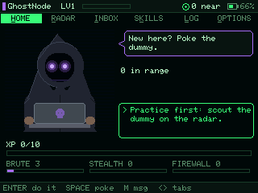</td>
<td>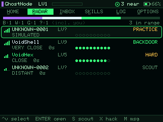</td>
</tr>
<tr>
<td align="center"><sub><b>HOME</b> — your hacker, what's around, and what to do next.</sub></td>
<td align="center"><sub><b>RADAR</b> — everyone in range, and how much of them you have read.</sub></td>
</tr>
<tr>
<td>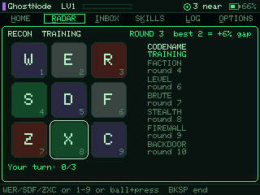</td>
<td>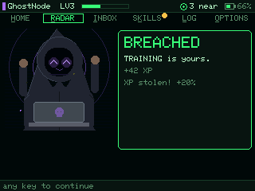</td>
</tr>
<tr>
<td align="center"><sub><b>RECON</b> — watch the sequence, repeat it on the keys. Each round strips a layer off them.</sub></td>
<td align="center"><sub>It notices how it went.</sub></td>
</tr>
</table>

> Every screen in this README is rendered from the source, not mocked up: the
> test suite runs the real firmware on a PC, plays it through the keyboard and
> trackball, and saves what the TFT would show. `cd test && make shots`.

---

## Contents

- [Playing on the T-Deck](#playing-on-the-t-deck) — controls and screens
- [Playing against other Cypher32 devices](#playing-against-other-cypher32-devices)
- [Hardware](#hardware) — what you need to buy
- [First-time setup](#first-time-setup) — flash, power, pick a side
- [The World Board](#the-world-board) — the worldwide online scoreboard
- [The optional phone portal](#the-optional-phone-portal)
- [Factions](#factions) · [Skills](#skills) · [Levelling](#levelling)
- [How hacking works](#how-hacking-works) — recon, intel tiers, the roll
- [LoRa protocol](#lora-protocol) — what actually goes over the air
- [Building and testing](#building-and-testing)

---

## Playing on the T-Deck

The bottom line of the screen always says what the keys do right now, so you
should never need this table. It is here anyway.

| Input | What it does |
|-------|--------------|
| Roll the trackball ◄ ► | Change tab |
| Roll the trackball ▲ ▼ | Move the highlight |
| Press the trackball, or <kbd>Enter</kbd> | Do the highlighted thing |
| <kbd>Backspace</kbd> | Back / close / erase |
| <kbd>H</kbd> <kbd>R</kbd> <kbd>I</kbd> <kbd>K</kbd> <kbd>L</kbd> <kbd>O</kbd> | Jump to HOME, RADAR, INBOX, SKILLS, LOG, OPTIONS |
| <kbd>M</kbd> | Write a message, from anywhere |
| <kbd>S</kbd> / <kbd>X</kbd> | Scout / breach the highlighted node (X twice: the first shows how hard, the second starts the breach) |
| <kbd>P</kbd> | Ping the highlighted node (round-trip time) |
| <kbd>B</kbd> | Send a beacon now |
| <kbd>G</kbd> | The World Board: your world rank and the top ten |

**HOME** is your hacker. The framed line is the move it thinks you should make
next — scout the practice dummy, spend a skill point, read someone deeper, or
breach someone you have read — and <kbd>Enter</kbd> does it. <kbd>Space</kbd>
pokes the avatar. It has opinions about that.

**RADAR** lists everyone in range, loudest first: signal bars, name (or
`UNKNOWN-xxxx` until you have scouted them), level, range, ten dots of intel,
and the verdict — how hard a breach would be (`EASY` `FAIR` `HARD` `BRUTAL`), `SCOUT`, `LOCK 4h 12m`, `OWNED`, `BACKDOOR` or
`IMMUNE`. The bar across the top is the faction census. Echoes — people only a
neighbour can hear — are listed underneath; you can only mail them.
<kbd>Enter</kbd> opens a node's **dossier**: everything recon has revealed, your
attempts left, the breach you would face (the gap and its window), and why
anything is greyed out.

**BREACH** is the hack itself: stop the ball in the gap. See
[the breach](#the-breach-the-timing-game-that-decides-a-hack).

**RECON** is the original sequence-memory game with the original rules: tiles
flash, you repeat them, each round adds one, one wrong tile ends the run, and
every round you clear reveals the next layer of the target at once. The grid is
<kbd>W</kbd> <kbd>E</kbd> <kbd>R</kbd> / <kbd>S</kbd> <kbd>D</kbd> <kbd>F</kbd> /
<kbd>Z</kbd> <kbd>X</kbd> <kbd>C</kbd> — the keys the T-Deck prints 1–9 on — or
roll and press the trackball. Every tile makes the same tick: a note per tile
would make sequences easier to remember than on the phone, which would be an
unfair edge over Wireless Paper players.

**INBOX** has every message, newest first, with the route it took; <kbd>Enter</kbd>
replies. Out of range is fine: the message goes as mail and travels with
whoever can reach them. **SKILLS** spends points. **LOG** is your record and the
last twenty things that happened. **OPTIONS** has the colour theme (phosphor,
amber, ice, paper), sound, brightness, the screen timeout, the keyboard light,
radio diagnostics, the phone portal and the factory reset.

**Things happen to you, not just on a tab.** A new signal, a message, someone
scouting you, someone trying to breach you, a hack verdict, a level-up — each
wakes the screen, plays a sound, sets the avatar off, and (for the big ones)
shows a card beside it. Cards never interrupt a recon run or a message you are
typing: they wait, then come up one at a time.

<table>
<tr>
<td>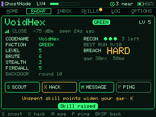</td>
<td>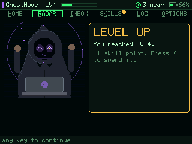</td>
</tr>
<tr>
<td align="center"><sub>A dossier. Everything recon has pulled out of them, and your odds.</sub></td>
<td align="center"><sub>Level up.</sub></td>
</tr>
<tr>
<td>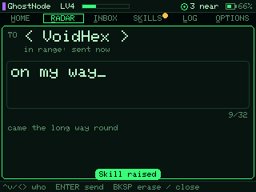</td>
<td>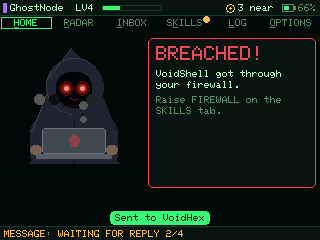</td>
</tr>
<tr>
<td align="center"><sub>32 characters, over the air.</sub></td>
<td align="center"><sub>Someone got in. It takes that personally.</sub></td>
</tr>
<tr>
<td>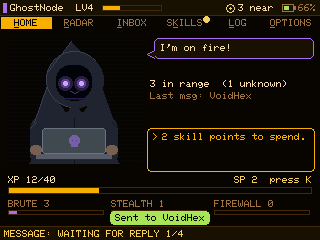</td>
<td>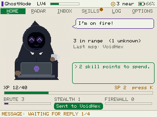</td>
</tr>
<tr>
<td align="center"><sub>Amber.</sub></td>
<td align="center"><sub>Paper, for daylight.</sub></td>
</tr>
</table>

**Battery.** The screen dims after 30 seconds untouched and switches off after
the timeout in OPTIONS (two minutes by default); any key wakes it, and so does
anything that happens to you. The radio keeps listening throughout. Wi-Fi is
off entirely unless you turn the phone portal on.

**Factory reset.** OPTIONS → Factory reset, type `WIPE`. If you have forgotten
nothing but locked yourself out somehow, there is also the hardware way: switch
the T-Deck off and on twice quickly (two boots shorter than six seconds), then
hold the trackball down for five seconds. The screen says what is happening at
every step, and letting go cancels.

---

## Playing against other Cypher32 devices

Everything that decides whether two devices can hear each other is shared with
upstream Cypher32 and has not been changed: frequency, spreading factor,
bandwidth, coding rate, sync word, packet formats and the frame-signing key.
The only radio changes are which GPIO pins the SX1262 sits on and the voltage
it feeds its crystal. The rules are shared too: the T-Deck's screens and the
phone portal both call the same game actions in `cypher32.ino`, so they cannot
disagree about what a move is allowed to do.

The one rule is the same as ever: **every device in a game must run the same
range profile** (FAST, LONG or EPIC). A T-Deck on LONG plays with a Wireless
Paper on LONG; a T-Deck on LONG cannot hear a Wireless Paper on FAST. LONG is
the default on both.

---

## Hardware

| Component | Detail |
|-----------|--------|
| Board | **LilyGo T-Deck**, **868 MHz** version |
| MCU | ESP32-S3 (16 MB flash, 8 MB PSRAM) |
| Display | 320 × 240 IPS TFT (ST7789) |
| Input | Keyboard, trackball |
| Sound | I2S speaker (MAX98357A) |
| Radio | SX1262 — 868 MHz EU ISM |
| Battery | LiPo via onboard charger (JST connector; the T-Deck ships without one) |

LilyGo sells the T-Deck with a 433, 868 or 915 MHz radio and antenna. Buy the
**868 MHz** one: the game runs at 868.1 / 869.525 MHz, and the others are
neither tuned for it nor fitted with the right antenna. The T-Deck Plus is the
same board with a GPS added and should work too, but has not been tested.

**Fit the antenna before you switch it on.** Transmitting into an empty
connector can damage the radio.

---

## First-time setup

Flash it. Power it. Pick a side. That's all it takes to enter the network.

### Step 1 — Flash the firmware

**From your browser — no toolchain.** Open
**[the installer page](https://stevenseagalstreams.github.io/T_Deck_Cypher32/)**,
plug the T-Deck in over USB-C, switch it on, pick a range profile and press one
button. The images on that page are built exactly the way the Arduino IDE
builds the sketch (same core, same board settings), and CI republishes the page
from the default branch on every change.

If the browser cannot connect, put the T-Deck into download mode by hand:
switch it off, hold the trackball pressed down, switch it on, let go.

**Switch it off and on again once flashing has finished.** A T-Deck left in
download mode (by hand, or because the browser could not reset it) shows a dark
screen until it is power-cycled. Still dark after that? Install again and
answer *yes* when asked to erase the device.

That needs the Web Serial API, which today means **Chrome, Edge or Opera on a
desktop computer**. Firefox and Safari do not implement it, and neither does
any phone or tablet browser — including Chrome on Android. The page says so
before you get as far as the button.

**It checks the board before it writes anything.** Press *Check this board* and
the page asks the chip what it is over the serial bootloader — nothing is
flashed by that step. It confirms the chip family and the flash size, and the
install button stays locked until it passes.

Both of those matter. The family is what makes the image runnable at all; the
flash size is what makes it fit, because this build uses the T-Deck's 16 MB
partition table and a smaller ESP32-S3 — a Heltec Wireless Paper, say — would
accept the image and then misbehave. The installer itself only checks the
family, so the size check is the one that catches that mistake.

What it *cannot* do is prove the board is specifically a T-Deck — any ESP32-S3
with 16 MB looks identical over the bootloader. The page says "consistent with"
rather than "confirmed", and reports the USB connection as corroboration rather
than proof. If the check cannot
run at all — an unreachable library, a port held by a serial monitor — it says
so and lets you install anyway, because a check that fails is not evidence
about your board.

Every image there is built by GitHub Actions from the commit it names, and
carries the **public default `LORA_KEY`** — so anyone who flashes from that
page can hear anyone else who did. That is the point for a public game; for a
private one, change the key and build it yourself.

<details>
<summary><b>Or build it yourself</b></summary>

**PlatformIO (recommended):**
```
pio run -e long -t upload      # or -e fast / -e epic
```
Dependencies are declared in `platformio.ini` and pulled automatically. There
is one environment per range profile; `long` is the default. The board
definition is in `boards/lilygo_t_deck.json`.

**Arduino IDE:**
1. Install the **esp32** board package (Espressif, 2.0.x or 3.x) via Boards Manager.
2. Install these libraries via Library Manager:
   - **RadioLib** (version 7.1 or later)
   - **Adafruit GFX Library**
   - **Adafruit ST7735 and ST7789 Library**
3. Open `cypher32.ino`. All headers must be in the same folder.
4. Board: **ESP32S3 Dev Module**, with Flash Size **16MB**, PSRAM
   **OPI PSRAM** (required: the build stops with an error without it), Partition Scheme **16M Flash (3MB APP/9.9MB FATFS)** or any
   16 MB scheme, USB CDC On Boot **Enabled**.
5. Click **Upload**.

When the upload finishes, the IDE may report *"A serial exception error
occurred: Cannot configure port"* just after **Hard resetting**. That is
harmless: the T-Deck has no USB-serial chip, so when it reboots into the new
firmware its USB port disappears and comes back, and the uploader loses it. If
the log says **Hash of data verified** for every part, the upload worked.

Watch the sketch size line: *"Maximum is 1310720 bytes"* means the 16 MB
partition scheme is not selected (that is the 4 MB default), and the next
feature added will not fit.

The sketch builds for the T-Deck by default; no flag is needed. (To build the
original Heltec Wireless Paper firmware from this tree, add
`#define CYPHER32_HELTEC` as the first line of `cypher32.ino`.) Tested with
Espressif's ESP32 core 2.0.17 and 3.2.0.

</details>

---

### Step 2 — Power on and pick a side

Plug in USB-C or connect a LiPo, fit the antenna, and slide the power switch
on. Your hacker introduces itself, tells you your codename — derived from your
chip, so it is the same on every device that hears you — and asks you to pick a
faction (see [Factions](#factions)). That choice is permanent until a factory
reset. Press <kbd>Enter</kbd> to jack in; the device restarts once, and you are
on the network.

<table>
<tr>
<td>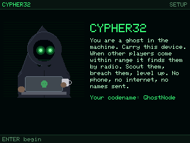</td>
<td>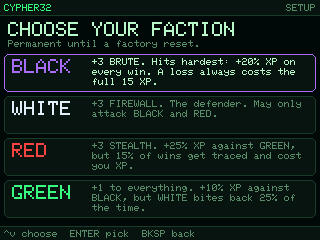</td>
</tr>
</table>

### Step 3 — Practise on the dummy

Until you reach level 2 there is a **practice dummy** on your radar that only
exists on your device. Your hacker's suggested move will point you at it:
scout it (the recon game), then breach it. Winning pays enough XP to level up,
and the dummy goes away — after that, the only targets are real.

---

## The World Board

<table><tr>
<td>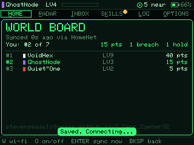</td>
<td>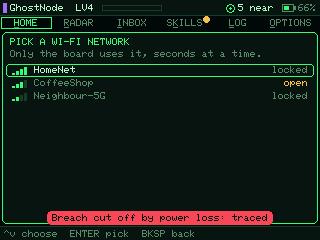</td>
</tr></table>

A worldwide scoreboard for every T-Deck that goes online. **Online is optional:**
the game is still played entirely over LoRa, and nothing is sent until you
switch the board on.

1. Press <kbd>G</kbd> (or Options → *World board*).
2. Press <kbd>W</kbd>, pick your Wi-Fi network, type its password.
3. That's it. The T-Deck joins that network for a few seconds every 15 minutes
   and about a minute after each fight, then drops it again. <kbd>O</kbd>
   switches it off, <kbd>Enter</kbd> syncs now.

The full board is public at
**[stevenseagalstreams.github.io/T_Deck_Cypher32/board.html](https://stevenseagalstreams.github.io/T_Deck_Cypher32/board.html)**.

**How points work.** 10 points for a breach, 5 for holding one off. A fight
only counts when **both** devices report it. The attacker's T-Deck says "I got
into X" and X's own T-Deck says "I was breached". They are paired by the radio
sequence number of that hack, which both of them saw. One modified device
cannot score on its own. At most 3 fights between the same two players count
per week, so nobody climbs by farming a friend. The game's own locks apply
too: one breach per pair per 12 hours.

**What is sent:** your chip id, codename, faction, level and XP, and your side
of each fight (who, the outcome, when). No location, no messages, no Wi-Fi
details. The public page shows codename, faction, level, points and when a
device last synced.

**What it cannot stop.** The game is open source and the radio key is
public, so there is no way to prove a hack really happened over the air. The
board makes cheating take effort, not impossible:
- Scoring needs two devices that agree, capped per pair.
- New devices are limited per internet connection.
- Every fight is kept, so an admin can ban an account (see
  [`supabase/`](supabase/)).

Only T-Decks report, because Heltec Wireless Papers have no World Board yet.
A fight against a Heltec is never confirmed.

## The optional phone portal

The original Cypher32 is played through a web page its device serves over its
own Wi-Fi. The T-Deck does not need it, and leaves Wi-Fi off — it is the
biggest drain on the battery. If you want it anyway (to show someone the game
on a big screen, say), turn it on in **OPTIONS → Phone portal**. You set a
password first — the network is open to anyone in range, and the password is
what stops them spending your skill points — and the device restarts. Then join
the Wi-Fi network `C32_<faction>_<name>` and open **192.168.4.1**.

Everything in the portal and on the device is the same game state, moved by
the same code; use either, or both.

---

## Factions

Four factions. Each one plays differently. Pick the one that matches your instinct — you can't change it without losing everything.

| Faction | Bonus | Perk | Risk |
|---------|-------|------|------|
| **BLACK** | +3 Brute Force | +20% XP on every successful hack | Full 15 XP loss on fail — no mitigation |
| **WHITE** | +3 Firewall | Fail penalty halved; attacks restricted to BLACK and RED | Limited target pool |
| **RED** | +3 Stealth | +25% XP against GREEN targets | 15% chance of XP loss even on a win |
| **GREEN** | +1 all skills | +10% XP against BLACK targets | 25% XP-loss risk when attacking WHITE |

**BLACK** hits hard and pays for every failure in full.  
**WHITE** plays a defensive game and picks its fights carefully.  
**RED** is a gambler — even victories carry risk.  
**GREEN** starts balanced but earns less unless it exploits its matchups.

---

## Skills

One **Skill Point** per level-up. Spend it in the **Skills** tab. At high levels every point shifts the math.

| Skill | Effect |
|-------|--------|
| **Brute Force** | Widens the gap when you breach someone. When you are breached, it blunts the attacker's Stealth |
| **Stealth** | Narrows the gap for anyone breaching *you*. When you breach, it counters the target's Brute Force |
| **Firewall** | Makes the ball run faster for anyone breaching you (and slower when you breach a weaker firewall). Cuts XP lost when your hack fails (floor 5) |

Every point carries the same total weight, split between attack and defence
differently for each skill, so there is no dead stat and no single build that
wins everything. See [the breach](#the-breach-the-timing-game-that-decides-a-hack).

Cap: **35** per skill (3 from faction + 32 earned through levels).

---

## Levelling

Every successful hack earns XP. Enough and you level up. The climb gets steeper the higher you go.

- **Max level:** 32
- **XP to clear a level:** `currentLevel × 10` — 10 at LVL 1, 100 at LVL 10,
  310 at LVL 31. Each level costs more than the last.
- **XP per hack:** `15 + target's Firewall × 5` — tougher targets pay more
- XP floor is 0. At LVL 32, surplus XP is discarded.

Reaching LVL 32 takes 4,960 XP, roughly 165 winning hacks. Early levels go
quickly — one good hack can carry you through two or three at the start — and
the climb lengthens steadily from there.

---

## How hacking works

This is what it's all for. (On the T-Deck: <kbd>R</kbd> for the radar,
<kbd>S</kbd> to scout, <kbd>X</kbd> twice to breach. The rules below are the
same whether you play on the device or through the phone portal.)

**1. Find a target.**  
Contacts appear in the **Radar** tab when their beacon reaches you, sorted by
signal strength with a plain-language range — VERY CLOSE, CLOSE, DISTANT,
FADING. That is *all* you get. No name, no faction, no level. An unscouted
contact is a signal, not a person.

**2. Run recon.**  

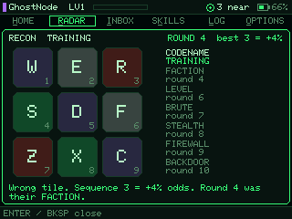

Recon is a **sequence-memory game**, and it is how anybody becomes somebody. A
grid of tiles flashes a pattern; repeat it. Each round adds one step. Every
round you clear strips another layer off the target — and the layer lands the
moment the round does, while you are still playing:

| Round | What comes back |
|-------|-----------------|
| 2 | their **codename** |
| 4 | their **faction** |
| 6 | their **level** |
| 7 | their **Brute Force** |
| 8 | their **Stealth** |
| 9 | their **Firewall** |
| 10 | a **backdoor** |

<br clear="all">

The furthest round you complete is also your recon score, and it widens the
breach: **+3% on the time the ball spends in the gap per round** — a perfect
10 gives **+30%**. And every stat recon reveals stops being a worst-case guess
(see below), so scouting only ever makes a breach easier.

One wrong tile ends the run. Everything you already pulled is yours to keep;
the rest stays dark.

**A perfect 10 leaves a backdoor open.** Their file stops expiring when the
cooldown does, their level and faction keep updating off their beacons on their
own, and walking back in costs you neither an attempt nor another game — one
tap re-pulls the whole dossier. It survives a reboot. It is the only thing in
the game that does.

You get **three attempts per node**, and an attempt is only spent once you
actually pull something: a target that never answers, or a run that dies in the
first round, costs nothing. Spend all three and recon is closed until that
node's cooldown ends — then it resets, three fresh attempts, and the file goes
back to a signal with no name on it. Unless you left a backdoor.

Two things identify someone for free, because they identified themselves:
**sending you a message**, and **attacking you**. Neither hands out the odds
bonus — that is only ever earned by playing.

**3. Breach.**  
One attempt, played as [the breach](#the-breach-the-timing-game-that-decides-a-hack):
stop the ball in the gap. Hit and your request goes out; the target finds out
the moment it lands. Miss and you are traced on the spot — a failed hack. (A
Heltec target still rolls its own dice for its own records; see below.)

**4. Win** — the node is yours and locked for **12 hours**.

**5. Lose** — locked out of that node for **30 minutes**. Move on.

A win closes the node for 12 hours. When that ends, recon resets too: three
fresh attempts and a clean slate on the sequence bonus — and everything you knew
about them goes dark again, unless you took the backdoor.

Both cooldowns survive a reboot and survive the target walking out of range, so
neither can be reset by power-cycling or waiting for them to drop off your radar.

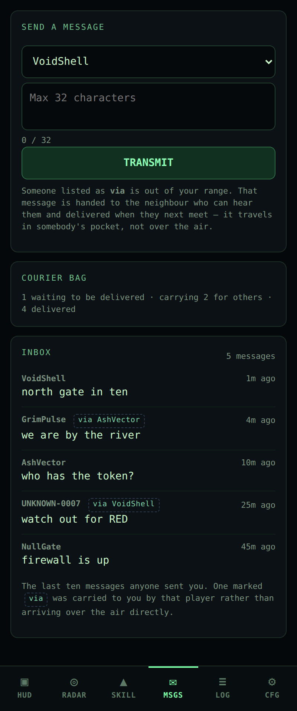

The Inbox keeps **the last ten messages anyone sent you**, newest first, each
showing the route it took. It survives the sender walking away: the per-node
inbox it replaced held one message per contact and lost all of them a few
minutes after that contact went out of range — which is exactly when you would
want to read them again.

**Talk to them.** 32 characters, straight over the air, no server in between.
Sending someone a message identifies you to them for free — you signed it by
sending it — but it buys them no odds against you. That is the only social
channel in the game, and it is the one people actually use: half of what
happens at a meet-up is negotiated in 32-character bursts.

<br clear="all">

### The breach: the timing game that decides a hack

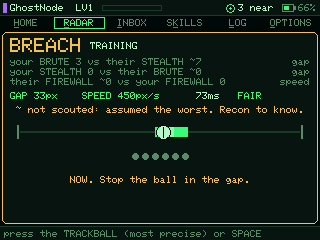

A thin line with a thick stretch on it — the gap in their defences. A ball runs
from end to end; press the **trackball** (or <kbd>Space</kbd>) to stop it.
Stop it in the gap and you are in. Miss, or let six passes go by, and you are
traced: XP lost and a 30-minute lock.

**Your stats and theirs shape it:**

- your **Brute Force** makes the gap longer; their **Stealth** makes it shorter
- their **Firewall** makes the ball faster; yours slows it down
- your **Stealth** against their **Brute Force** nudges the gap too
- every recon round adds 3% to the time the ball spends in the gap

What decides how hard a breach is, is one number: **how long the ball spends
inside the gap on each pass** — the *window*. The screen shows it before you
press, with a grade, and so do the dossier and the radar:

| Grade | Window | A typical player hits about |
|-------|--------|------------------------------|
| **EASY** | 91 ms and up | 75% or more |
| **FAIR** | 65–90 ms | 60–75% |
| **HARD** | 45–64 ms | 45–60% |
| **BRUTAL** | under 45 ms | less — but a sharp player still can |

```
window = 65 ms × e^(1.75 × (your BRUTE − their STEALTH) / K)
               × e^(1.05 × (your STEALTH − their BRUTE) / K)
               ÷ e^(1.40 × (their FIREWALL − your FIREWALL) / K)
               × (1 + 3% per recon round)          held within 30–100 ms
speed  = 450 px/s × e^(1.40 × (their FIREWALL − your FIREWALL) / K)
gap    = window × speed
K      = 6 + every skill point both of you own
```

**It scales forever.** Only stat *differences measured against all the points
in play* count, so a point is worth the same share of a fight at level 32 as at
level 3, and the same wherever you put it. Two equal players get the same
window whether they are both level 1 or both level 32, and a level 27 against a level 32 is as up against it as a 5
against a 6. No way of spending your points pulls ahead as the levels climb.

**Not scouting is never a shortcut.** Levels are public (every beacon carries
one), so a player's total points are known. Any stat recon has not revealed is
assumed to be spread in whatever way would make *this* breach hardest (within
what their faction, once scouted, guarantees) — so each
round of recon can only make the breach easier or leave it as it was.

**The controls are judged by the clock, not the screen.** The trackball press
is timestamped by an interrupt the instant it goes down, and the ball's
position is a pure function of time, so a busy frame can never move the ball
under your finger. The judgement also allows for the display's own delay, and
the keyboard's (the trackball is the precise control). After each press the
screen tells you how many milliseconds early or late you were.

**The practice dummy** gives a kinder gap, so a new player can learn the rhythm
before it counts.

**Against a Heltec device** the timing game still decides it on your side: a
hit is a won hack for you. The Heltec cannot play the game, so it rolls its own
dice for its own records (the old formula: `60% + 1.5% per recon step + 2% per
Brute over their Firewall + 1% per Stealth`, 25–90%). A miss is never sent to a
Heltec at all. Between two T-Decks the defender honours the game's result — as
long as the attacker's own locks would have allowed the try — so both screens
always agree.

RED and GREEN carry their own backfire risks on top of any breach.

<br clear="all">

---

## LoRa protocol

Signal only. No names. No location. Nothing beyond what the game requires.

### Range profiles

**Every device in your game must be flashed with the same profile.** Spreading
factor and frequency are both part of how a LoRa receiver locks onto a signal.
Two devices on different profiles are not weakly connected — they are deaf to
each other and will never appear on each other's radar.

Set it at the top of `cypher32_packets.h`:

```c
#define LORA_PROFILE LORA_PROFILE_LONG
```

| Profile | Radio | Range | Per node | 20 devices |
|---|---|---|---|---|
| `FAST` | SF7 @ 868.1 MHz, 14 dBm | baseline | 0.30 % | 6 % of channel |
| `LONG` *(default)* | SF9 @ 869.525 MHz, 22 dBm | **~3×** | 0.70 % | 14 % |
| `EPIC` | SF11 @ 869.525 MHz, 22 dBm | **~4.6×** | 1.81 % | 36 % — too crowded |

Two things move range, and this project previously used the short end of both.

**Spreading factor.** SF7 is the *fastest and shortest-range* setting LoRa has.
Every step up is +2.5 dB of receiver sensitivity and double the airtime.

**Sub-band.** ETSI splits 868 MHz into bands with different limits. `g1`
(868.0–868.6) allows 14 dBm and 1 % duty cycle; `g3` (869.4–869.65) allows
27 dBm and **10 %**. The SX1262 caps at 22 dBm, so moving to g3 is +8 dB and
ten times the airtime budget. It is the same band Meshtastic uses for its EU
region, for the same reasons.

Pick `EPIC` only for a handful of people spread across a city. The limit that
bites first is not the law, it is the shared channel: a CAD-gated ALOHA channel
starts losing frames to collisions above roughly a third occupancy, and twenty
devices on `EPIC` would sit at 36 %. Range and capacity are the same budget
spent twice.

Every link-layer timeout is derived from the profile's airtime rather than
hardcoded, so changing the profile re-times the whole stack. `make profiles` in
`test/` builds and runs the suite against all three.

### Range in practice

Firmware is only half of it. Before changing the profile, check:

- **The antenna.** The stock wire antenna is the single biggest variable. It
  must be connected before powering on — transmitting into an open connector
  can damage the radio — and a proper 868 MHz half-wave whip is worth more than
  a spreading factor step.
- **Height and body.** A device in a trouser pocket is being shielded by a bag
  of salt water. Ten metres of elevation beats almost anything you can change
  in software.
- **Line of sight.** The 2–15 km figures are open ground or rooftop to rooftop.
  In a city at street level, expect hundreds of metres at `FAST` and something
  over a kilometre at `LONG`.

All traffic runs at **BW 125 kHz — CR 4/5 — sync 0x12**, with frequency, spreading factor and power set by the profile. Small packets; devices are never quiet for long.

| Packet | Type | Purpose |
|--------|------|---------|
| `BEACON` | broadcast | Presence pulse — level and faction only |
| `RECON_REQ` | unicast | Open a scouting link on a target |
| `RECON_REPLY` | unicast | Target returns its full file — level, faction, Brute, Stealth, Firewall |
| `HACK_REQ` | unicast | Attack initiated — carries attacker's Brute |
| `HACK_REPLY` | unicast | Defender returns Firewall and faction |
| `HACK_RESULT` | unicast | Outcome and XP delta sent to defender |
| `MSG` | unicast | Raw text, 32 chars |
| `ACK` | unicast | Link-layer acknowledgement |
| `PING` | unicast | Reliable no-op — round-trip probe |
| `ECHO` | broadcast | A list of the sender's own direct neighbours |
| `MAIL` | unicast | A message being carried on somebody else's behalf |

All of it is defined in `cypher32_packets.h`.

Beacons go out at roughly half the steady interval while you're discovering,
easing off once the neighbourhood is known — 25–35 seconds on `FAST`, longer on
the slower profiles because a beacon at SF11 is thirteen times the airtime of
one at SF7. The interval is jittered: a fixed cadence lets two devices lock into
phase and collide on every single beacon.

Every unicast carries a sequence number and is acknowledged. Unacknowledged
frames are retried up to four times before the portal reports `NO RESPONSE` —
an action never just silently disappears. Duplicates are suppressed, replies are
deferred so they don't collide with the requester re-arming its receiver, and the
radio listens before transmitting.

Every frame also carries a 4-byte HMAC tag keyed on a shared secret.
**Change `LORA_KEY` in `cypher32_packets.h` before you deploy.** It is not real
security — the key is compiled into every device — but it stops someone with a
spare radio injecting packets to award themselves XP.

Airtime is metered against the EU 868 duty cycle limit and diagnostics live at
`192.168.4.1/api/diag`.

### Reaching past your own radio

Two Cyphers that cannot hear each other can still know of each other, and can
still exchange a message — without anything being relayed.

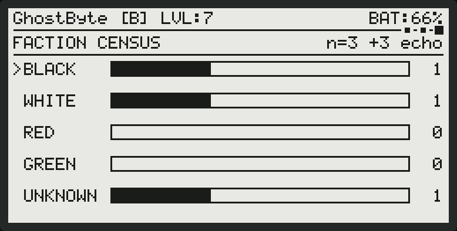

**Echoes.** Every couple of minutes each device broadcasts a short list of the
neighbours it can currently hear. You pick that up from someone in range and
learn who *they* can hear: two hops of visibility, and no further, because an
echo is never forwarded. Those contacts appear in their own **ECHOES** section
on the radar, dashed and greyed, showing which of your neighbours bridges to
them.

An echo is a rumour, not a contact. You cannot scout it, cannot hack it, and it
is counted by nothing — not the census, not the leaderboard, not your contacts
total. It has no signal bars either, because the only signal strength anyone
measured belongs to the device that relayed it; printing that would put "VERY
CLOSE" on somebody a kilometre away. It has no codename either, unless you
already own a backdoor on them: recon is still the only way anyone gets a name.

**Courier mail.** You can write to an echo. The message is handed to the
neighbour who can reach them and delivered when those two are next in range —
it travels in somebody's pocket, not over the air. The portal shows what is
waiting and what you are carrying for other people. A message is carried at
most once, so it can never circle; undelivered mail expires after half an hour.

When it arrives it says who brought it. The Inbox marks a carried message
`via <name>`, and the device's message page reads `MAIL BlazeWorm via
VoidShade`. Delivering somebody's post identifies the courier the same way
writing to you does — a codename, nothing more, and no recon bonus with it.

Carrying somebody's mail is worth a line in your log and nothing else. There is
no XP in it, deliberately: the moment relaying pays, the best move is to leave
the device on a windowsill, and this is a game about walking around.

The census page on the device says the same thing in one number: `n=3 +3 echo`
counts the room, then how far past it your knowledge reaches. The echoes are
never added to the census itself — only reported alongside it.

**Why not a full mesh.** Rebroadcasting beacons would cost each device 3.43%
duty cycle in a room of twenty, against a 1% EU legal limit — illegal at six
devices. Echo costs one frame per device per two minutes no matter how many
there are. The full arithmetic is in `ROADMAP.md`.

---

## Building and testing

### File structure

| File | Purpose |
|------|---------|
| `cypher32.ino` | Main sketch — game logic, the shared game actions, e-ink screens, portal API |
| `cypher32_packets.h` | Packet types, `KnownNode`, node helpers, shared key |
| `cypher32_lora.h` | LoRa stack — link layer, retries, presence, diagnostics |
| `cypher32_crypto.h` | SHA-256 / HMAC-SHA256 for frame signing |
| `cypher32_portal.h` | The web portal, one HTML/CSS/JS blob in PROGMEM |
| `cypher32_qr.h` | Minimal QR encoder for the Wi-Fi join code |
| `tdeck_hw.h` | T-Deck pins, power, shared SPI bus, TFT, backlight, keyboard, trackball |
| `tdeck_app.h` | The T-Deck game: every screen, recon, compose, cards, notifications, power |
| `tdeck_avatar.h` | The living avatar, drawn and animated procedurally |
| `tdeck_sound.h` | A tiny square-wave synth on the I2S speaker, and the game's sounds |
| `platformio.ini` | PlatformIO build config (T-Deck default, Heltec still available) |
| `boards/lilygo_t_deck.json` | PlatformIO board definition for the T-Deck |
| `ROADMAP.md` | Development plan and current status |
| `test/` | Everything below |
| `docs/img/` | Generated — see `make shots` |

### Tests

```
cd test && make          # everything
cd test && make asan     # the C++ suites under AddressSanitizer + UBSan
cd test && make shots    # regenerate every image in docs/img
```

| Stage | What it does |
|-------|--------------|
| `lint` | Every ALL-CAPS constant in the sketch resolves to a `#define` |
| `sketch` | **Compiles `cypher32.ino`** against host stubs in `test/stub/` |
| `run` | Link layer (188 checks), a two-node radio simulation over a lossy channel (50), a four-node mesh (69), and the page button (32) |
| `profiles` | The link and mesh suites rebuilt against **all three range profiles** |
| `portal` | The real portal HTML against a DOM shim — render, the mini-game, the alert |
| `layout` | The page in real Chromium at five phone sizes — nothing off-screen, nothing unreachable |
| `flasher` | The browser installer page in real Chromium — the profile picker, the browser gate, a blocked CDN |
| `qr` | The encoder against `python-qrcode`, then the result decoded by OpenCV |
| `tdeck` | **The T-Deck edition, played on the PC**: the real sketch and app with the real Adafruit GFX, driven by scripted keys and trackball — setup, recon, the breach timing game and its balance, skills, messages, cards, power saving, the World Board against a fake server (140 checks) — and every screen saved |

**The firmware is compiled for the real chip in CI.** `.github/workflows/firmware.yml`
builds all three range profiles for the T-Deck with PlatformIO on every push,
merges each into a single flashable image, and publishes the installer page. Until that existed,
this firmware had never been built for an ESP32 at all.

Two of the host stages are worth spelling out, because they run where **no
ESP32 toolchain is available** and nothing else covers what they cover:

**`make sketch` builds the firmware against stubs.** `test/render_eink.cpp`
includes `cypher32.ino` and links it against stubs for the display, Wi-Fi, NVS,
the web server and the radio. It will not catch a bad pin mapping or a linker
script problem — that is what the CI build is for — but it catches every typo,
every changed signature and every missing declaration in a second, without
waiting for a toolchain.

**`make tdeck` plays the T-Deck edition without a T-Deck.** `test/render_tdeck.cpp`
includes the whole sketch with `CYPHER32_TDECK`, links the real Adafruit GFX
library, and stubs only the TFT (a framebuffer), the keyboard (a queue of
keypresses) and the radio. It then plays: first-run setup, three rounds of
recon on the practice dummy read off the screen's own sequence, a deliberate
miss, the hack, a level-up, spending a skill point, replying to a message — and
the edge cases the reviews turned up, such as a card arriving mid-recon or
mid-sentence, a node re-sorting under the highlight, or `millis()` passing
2³¹. Every screen it passes through is saved as an image.

**The e-ink screens are rendered, not photographed.** The same program runs the
sketch's own `displayIdle()`, `displayNewNode()` and friends into a 250×122
framebuffer and dumps it. That is where the images in this README come from,
and it is why they cannot drift from the code. It also means the join QR can be
scanned off the panel as the panel would actually draw it — three pixels per
module, beside two lines of text — which `test_qr_panel.py` does on every run.

The portal screenshots come from `test/shoot_portal.js`, which loads the same
HTML blob the device serves into headless Chromium and answers its API calls.
It needs Chromium and Pillow, so it is not part of `make`.

None of this substitutes for the bench test and field protocol in
`ROADMAP.md` — it exercises logic and pixels, not radios.

---

## License

MIT
